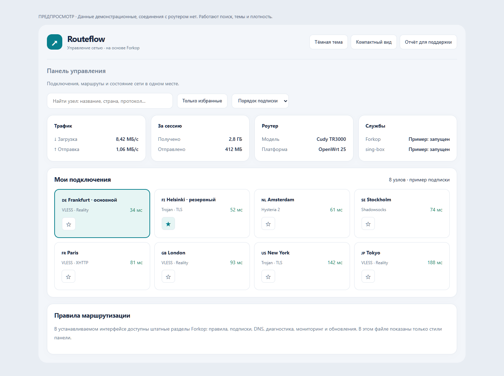

# Routeflow

Улучшенный интерфейс и дополнительные инструменты для [Forkop](https://github.com/ushan0v/forkop) на OpenWrt.



## Что добавлено

- Светлая и тёмная темы, сохранение выбора в браузере.
- Компактный вид и адаптация панели под телефон.
- Поиск узлов по названию и протоколу, включая данные после автоматического обновления.
- Избранные узлы и отдельный фильтр. Избранное хранится в этом браузере и идентифицируется по секции и коду узла.
- Сортировка узлов по измеренной задержке в пределах своей группы; неизмеренные узлы идут в конце. Сортировка меняет отображение, выбор маршрута остаётся штатным.
- JSON-отчёт для поддержки: версии компонентов, состояния служб и проверок, количество узлов. Прокси-ссылки, подписки, IP-адреса, журналы и подробные значения проверок не экспортируются.
- Установщик проверяет SHA-256 пакетов и сохраняет конфигурации Forkop, sing-box и DHCP в `/etc/routeflow/backups/` с доступом для root.

Подписки, DNS, маршрутизация, мониторинг, XHTTP и управление компонентами используют движок Forkop. Имена пакетов и конфигурации сохраняются: `forkop`, `luci-app-forkop`, `/etc/config/forkop`. Встроенные обновления получают пакеты из этого репозитория.

## Статус

Первая предварительная версия. Целевое устройство — Cudy TR3000 с 128 МБ флеш-памяти и OpenWrt 25. Сборка TypeScript и браузерные проверки выполнены локально. Реальная установка, трафик и совместимость с конкретной прошивкой роутера пока не проверены. APK/IPK собираются GitHub Actions; устанавливайте после успешной сборки релиза.

128 МБ здесь обозначает вариант флеш-памяти устройства. Установщик отдельно проверяет свободное место и систему. Прошивать роутер для установки приложения не требуется.

## Установка с GitHub

Откройте [релиз 1.0.0](https://github.com/suhrob6000/routeflow/releases/tag/1.0.0) и убедитесь, что APK/IPK и `SHA256SUMS` уже опубликованы.

В SSH-терминале роутера под root:

```sh
wget -O /tmp/routeflow-install.sh https://raw.githubusercontent.com/suhrob6000/routeflow/1.0.0/install.sh
sh /tmp/routeflow-install.sh
```

Установщик использует APK или IPK по установленному пакетному менеджеру. Для первого релиза версия закреплена на `1.0.0`; предварительные релизы доступны через API по тегу. Выбор варианта sing-box остаётся интерактивным. Конфигурация сохраняется до изменения пакетов.

Затем откройте **Службы → Forkop** в LuCI и обновите страницу с очисткой кэша. Заголовок панели — **Routeflow**. На роутере пользователя указан адрес `192.168.2.1`; этот адрес не зашит в приложение.

При обновлении с другой версии Forkop сначала сохраните резервную копию OpenWrt в LuCI и обеспечьте локальный доступ к роутеру. Копии из `/etc/routeflow/backups/` содержат конфигурационные секреты и предназначены для локального восстановления; не публикуйте их. Эти копии восстанавливают конфигурацию, для возврата старых пакетов нужно переустановить соответствующий релиз.

## Предпросмотр и разработка

Откройте [preview.html](preview.html) в браузере. Данные демонстрационные; работают темы, плотность, поиск и избранное. Сортировка в приложении использует задержки от движка, отчёт берёт реальные состояния из хранилища Forkop.

```sh
cd fe-app-forkop
npm ci
npx vitest run
npm run build
```

Сборка пакетов для релиза запускается тегом вида `1.0.0` или вручную в GitHub Actions. Скрипт `build.sh` использует OpenWrt SDK на Linux. Собранный JavaScript включён в исходники.

## Происхождение и лицензия

Основа: `ushan0v/forkop`, commit `dd483297be0ac4e52bb8f482e2640238b75af532`; Forkop основан на Podkop. Исходный README сохранён в [README.upstream.md](README.upstream.md). Лицензия проекта: [GPL-2.0](LICENSE), исходные уведомления сохранены. Новые модули Routeflow публикуются на тех же условиях.
